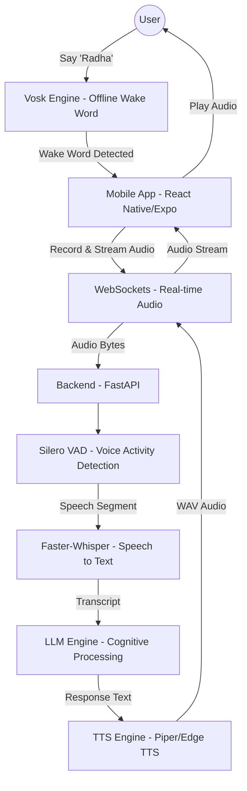

# System Architecture

Radha uses a modern, distributed architecture designed for low-latency voice interaction.

## High-Level Overview

## Component Breakdowns

### 1. Mobile Client (`/radha`)
- **Wake Word Service**: Runs a compiled Vosk model on-device. It monitors the microphone constantly but never sends data to the server until "Radha" is heard.
- **Voice Client**: Manages a full-duplex WebSocket connection. It handles audio recording (16kHz PCM) and playback.
- **UI State Machine**: Transitions between `Sleeping`, `Wake Word Detected`, `Listening`, `Processing`, and `Talking`.

### 2. Backend Server (`/backend`)
- **FastAPI Framework**: High-performance asynchronous server for routing WebSocket traffic.
- **Voice Engine**: A unified wrapper for STT, VAD, and TTS.
  - **VAD**: Uses Silero VAD to filter non-speech audio.
  - **STT**: Uses `faster-whisper` for high-speed local transcription.
  - **TTS**: Prioritizes `Piper` for low-latency local synthesis, with `Edge TTS` as a high-quality cloud fallback.
- **LLM Engine**: Processes user intents and generates natural language responses.

## Communication Protocol
- **Format**: All audio is exchanged in 16-bit PCM WAV format at 16,000Hz (Mono).
- **Network**: WebSockets (WS) are used instead of REST for persistent, bi-directional communication, reducing handshake overhead.
